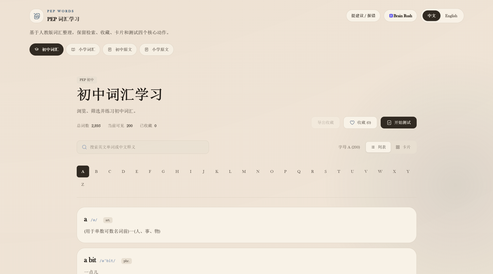

# PEP Words



<p align="center">
  <a href="https://pep-words.lizliz.xyz/">Live site</a>
  ·
  <a href="./README.md">中文</a>
</p>

`PEP Words` is a lightweight vocabulary study site for PEP English word lists. It supports lookup, browsing, favorites, flashcards, quizzes, and direct reading of the source word-list documents.

It is not a full learning-management system. There are no accounts, sync, ads, tracking, or heavy backend features. The product goal is deliberately narrow: make the everyday vocabulary loop fast, clear, and stable for students, parents, and teachers.

## Live Site

- Production: <https://pep-words.lizliz.xyz/>
- Legacy blue visual comparison: <https://pep-words.lizliz.xyz/legacy-blue>

## Features

- Separate primary-school and middle-school vocabulary datasets
- Search by English word or Chinese meaning
- A–Z alphabet filtering
- Favorite words and export them
- Flashcard review mode
- Multiple-choice quiz mode
- Chinese / English interface switching
- Direct markdown source-list reading

## Routes

- `#/middle-school`: middle-school vocabulary learner
- `#/primary-school`: primary-school vocabulary learner
- `#/docs/middle-school`: middle-school source document
- `#/docs/primary-school`: primary-school source document

## Tech Stack

- `React 19`
- `Vite`
- `TypeScript`
- `Tailwind CSS 4`

The runtime dependency surface is intentionally small: only `react` and `react-dom` are required at runtime. The app is built as static assets and works well on static hosting platforms such as Cloudflare Pages.

## Local Development

```bash
npm install
npm run dev
```

Common checks:

```bash
npm run check
npm run build
npm run words:validate
npm run words:validate-enrichment
```

Preview the production build:

```bash
npm run preview
```

## Data Boundary

Active runtime data lives in:

- `src/data/middle_school.json`
- `src/data/primary_school.json`
- `src/data/enrichment/`
- `src/data/*.md`

Cleanup and validation scripts live in `scripts/`. Passing validation means the structure and obvious formatting rules are OK; it does not prove every definition, phonetic symbol, or source mapping is perfect. Content quality should still be checked against source material and sampling reviews.

## Deployment

Recommended deployment: GitHub-connected Cloudflare Pages.

- Build command: `npm run build`
- Output directory: `dist`
- Production URL: <https://pep-words.lizliz.xyz/>

`public/_redirects` keeps direct SPA paths such as `/legacy-blue` routing back to `index.html`.
